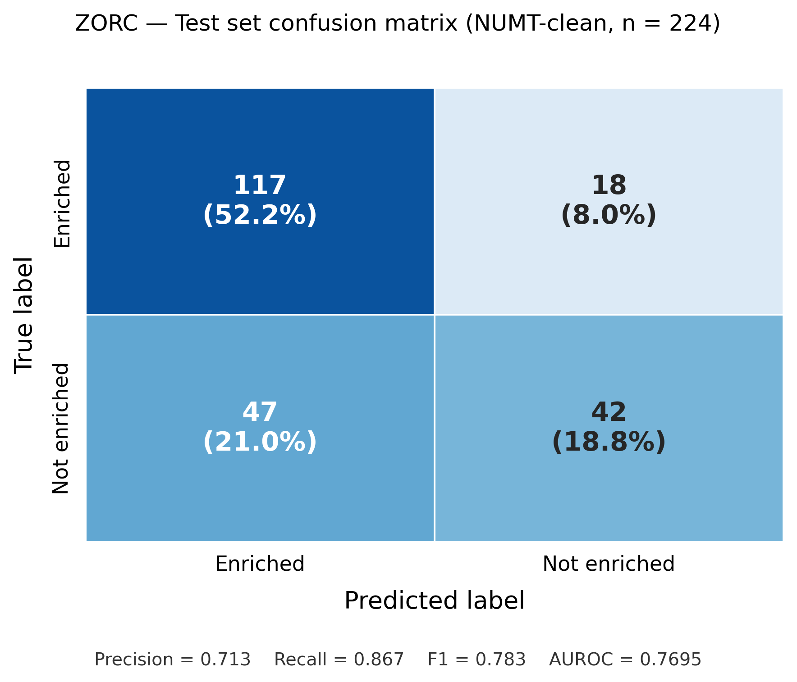

# 🧬 ZORC — Zip-code Of RNAs that Condense

[](https://github.com/MoschouLab/ZORC/actions/workflows/ci.yml) [](LICENSE) [](https://doi.org/10.5281/zenodo.20342217) [](https://www.python.org/) [](https://hub.docker.com/r/moschoulab/zorc-predictor)

> **Machine learning pipeline to predict P-body coregulon membership (cognate mRNAs and proteins) in *Arabidopsis thaliana*. Part of the PLANTEX ERC Consolidator Grant — MoschouLab / IMBB-FORTH, Crete, Greece.**

---

## Overview

Processing bodies (P-bodies) are membraneless cytoplasmic condensates that concentrate specific mRNAs and RNA-binding proteins during cellular stress responses. In plants, P-bodies play a central role in mRNA triage — sorting transcripts for storage, deadenylation, or decay — and their composition changes dynamically between normal conditions and heat stress. Identifying which mRNAs are enriched in P-bodies, and understanding the sequence features that drive their selective condensation, is key to deciphering post-transcriptional gene regulation in *Arabidopsis thaliana*.

ZORC is an end-to-end machine learning pipeline that integrates three layers of molecular information to predict P-body coregulon membership: (1) isoform-level mRNA sequence features including nucleotide/dinucleotide composition, m6A motif density, UTR architecture, and RNAfold minimum free energy; (2) protein conformational ensemble dynamics computed by BioEmu v1.1 (root-mean-square fluctuation profiles, radius of gyration, contact density); and (3) intrinsically disordered region content estimated by AIUPred v2.0. The final model is a Platt-calibrated Random Forest trained on 61 features.

The training dataset is derived from the T-RIP DCP1 experiment (Liu, Mentzelopoulou et al. 2024, *The Plant Cell*, DOI [10.1093/plcell/koad127](https://doi.org/10.1093/plcell/koad127)), which quantified RNA enrichment in P-bodies under normal and heat-stress conditions via affinity purification of tagged DCP1. After removing 68 pericentromeric NUMT pseudogenes that contaminated the negative class, the clean dataset comprises 1,434 *Arabidopsis* genes (888 enriched / 546 non-enriched) with a near-balanced class ratio. The anti-leakage split is performed at the CD-HIT cluster level (40% identity) to prevent paralog data leakage between train, validation, and test sets.

---

## Key Results

| Metric | Value |
|--------|-------|
| 📈 Test AUROC | **0.7695** |
| 📊 Test AUPRC | **0.8350** |
| 🎯 F1-macro | **0.6732** |
| ✅ HC validation | **24/25** (96%) |
| 🔍 Recall (enriched class) | **0.867** |
| 🎯 Precision (enriched class) | **0.713** |
| 🌱 Training genes | **1,434** (NUMT-clean) |

*NUMT-clean dataset: 68 pericentromeric pseudogenes removed from the negative class. HC validation: 25 lab-curated high-confidence P-body genes (independent of training data).*



*Confusion matrix on the held-out test set (n=224, NUMT-clean). The model achieves 86.7% recall on the P-body enriched class, correctly recovering the majority of positive examples while maintaining 71.3% precision.*

---

## Pipeline Architecture

- 🌱 **P1 — Coregulon assembly** — Integrate T-RIP RNA enrichment (Liu et al. 2024 *Plant Cell*) with APEAL proteomics (Liu et al. 2023 *EMBO J*); define 888 positives + 546 negatives after NUMT correction
- 🔬 **P2 — Isoform selection** — rMATS-guided splice-form assignment (303 stress-regulated isoforms) with canonical transcript fallback (1,201 genes)
- 🧬 **P3 — Sequence extraction** — gffread extraction of isoform mRNA and protein FASTA sequences from the TAIR10 reference genome
- 📐 **P4 — RNA feature computation** — 41 features: nucleotide/dinucleotide composition, m6A RRACH motif density, UTR length fractions, RNAfold MFE per nucleotide (max 3000 nt)
- 🌀 **P5 — IDR annotation & BioEmu tier assignment** — AIUPred v2.0 IDR% per protein; assign Tier 1 (<10% IDR, AF2 only), Tier 2 (10–30%, 50 conformations), Tier 3 (≥30%, 100 conformations)
- ⚛️ **P6 — BioEmu conformational sampling** — GPU-accelerated diffusion ensemble generation (1,452/1,457 proteins; RTX A5000, ~5 days); AF2 structures for Tier 1 via P6b
- 🔧 **P7 — Protein dynamic features** — 18 features from BioEmu ensembles: N/C-terminal RMSF, radius of gyration mean/CV, contact density, pass rate, n_residues, IDR%
- 🗂️ **P8 — Feature matrix assembly** — 1,434 × 61 feature matrix; CD-HIT 40% identity cluster-based 70/15/15 anti-leakage train/val/test split
- 🤖 **P9–P9f — Machine learning** — Random Forest (500 trees, balanced class weights) and XGBoost comparison; feature engineering; SHAP interpretability; Platt calibration; NUMT-clean rerun
- 🐍 **P10 — Snakemake workflow** — 15 rules with conda directives and a DAG visualisation; full pipeline reproducibility from raw data to final model
- 📊 **P11 — Data analytics dashboards** — SQLite + DuckDB analytical backend; Streamlit prototype; 6-page Plotly Dash app (SHAP importance, probability landscape, model history); Tableau CSVs
- 📦 **P12 — MLOps & engineering** — MLflow experiment tracking (6 retroactive runs), DVC model versioning (11 artefacts), FastAPI REST service (`/predict`, `/lookup`, `/health`), Docker Hub (`moschoulab/zorc-predictor:1.1`), GitHub Actions CI (47 tests, 86% coverage), EvidentlyAI drift reports, Prometheus `/metrics`
- 🗺️ **P13 — Spatial validation** *(pending experimental)* — STOmics / MERFISH spatial transcriptomics of *Arabidopsis* seedlings under heat stress, combined with expansion microscopy and padlock probe validation of top ZORC candidates; facility submission before summer 2026
- 🤖 **P14 — Generative AI agent** — ChromaDB + LangChain RAG over 10 P-body literature PDFs (1,244 vectors); LangGraph StateGraph agent with three nodes (prediction → literature retrieval → LLM report generation) and conditional routing (Claude claude-sonnet-4-6 via Anthropic SDK)

---

## Repository Structure

- 📁 **scripts/** — Numbered pipeline scripts P1–P9f + helper utilities (01–09f)
- 📁 **config/** — `zorc_config.yaml` single source of truth for all parameters and paths
- 📁 **data/**
  - 📁 **data/raw/** — Third-party source data (gitignored; not redistributed)
  - 📁 **data/processed/** — Pipeline outputs (CSVs, manifests; sequences and BioEmu trajectories gitignored)
- 📁 **results/** — Model files (DVC-tracked), SHAP CSVs, prediction tables
  - 📁 **results/figures/** — Publication figures (confusion matrix, SHAP plots)
- 📁 **envs/** — Conda environment YAML files (`zorc_pipeline.yml`, `bioemu_ref.yml`)
- 📁 **api/** — FastAPI prediction service (`main.py`, `feature_compute.py`, imputation medians)
- 📁 **docker/** — Dockerfile (multi-stage, ViennaRNA from source)
- 📁 **dashboard/** — Plotly Dash multi-page app (6 pages)
- 📁 **notebooks/** — Jupyter analysis notebooks
- 📁 **agent/** — LangChain RAG ingestor + LangGraph ZORC agent
- 📁 **monitoring/** — EvidentlyAI drift reports + Prometheus config
- 📁 **tests/** — pytest suite (47 tests, 86% API coverage)
- 📁 **docs/** — Methodological decisions log, architecture roadmap, session prompts
- 📁 **logs/** — Per-phase audit reports (structured text)
- 📄 **Snakefile** — Snakemake workflow (15 rules)
- 📄 **requirements.txt** — pip-compatible runtime dependencies

---

## Quick Start

### 🐳 Docker (recommended)

```bash
docker pull moschoulab/zorc-predictor:1.1
docker run -p 8000:8000 moschoulab/zorc-predictor:1.1
# Swagger UI: http://localhost:8000/docs

# Look up a gene by AGI code
curl http://localhost:8000/lookup/AT5G47010
# → {"gene_id": "AT5G47010", "prob_pos": 0.93, "prediction": "enriched", "confidence": "high"}
```

### 🐍 Full pipeline (conda)

```bash
conda env create -f envs/zorc_pipeline.yml
conda activate zorc_pipeline

# Run step-by-step
python scripts/01_build_coregulon.py --config config/zorc_config.yaml
# ... through ...
python scripts/09f_final_model.py --config config/zorc_config.yaml

# Or run the full Snakemake workflow (P1–P9f)
snakemake --cores 4 --use-conda
```

> **Note:** P6 (BioEmu conformational sampling) requires a CUDA GPU and the separate `bioemu` conda environment (`conda activate bioemu`). Runtime ~5 days on RTX A5000.

### 🤖 LangGraph agent

```bash
conda activate zorc_pipeline
export ANTHROPIC_API_KEY=sk-ant-...
uvicorn api.main:app --port 8000 &  # start prediction API

# Query a single gene
python agent/run_agent.py AT5G47010

# Query multiple genes
python agent/run_agent.py AT5G47010 AT3G22270 AT1G01470

# JSON output
python agent/run_agent.py AT5G47010 --json
```

### 📊 Interactive dashboards

```bash
conda activate zorc_pipeline

# Plotly Dash (6 pages: coregulon explorer, SHAP, probability landscape, etc.)
python dashboard/dash_app.py
# → http://localhost:8050

# Streamlit prototype
streamlit run dashboard/streamlit_app.py
```

---

## Running Tests

```bash
pip install -r requirements.txt
pytest tests/ --cov=api -v
# 47 tests, 86% coverage on api/
```

---

## Data and Methods

| Item | Details |
|------|---------|
| Input data | T-RIP DCP1 enrichment + APEAL proteomics — Liu et al. 2024 *Plant Cell* [DOI 10.1093/plcell/koad127](https://doi.org/10.1093/plcell/koad127) |
| NUMT correction | 68 pericentromeric pseudogenes (AT2G07xxx loci) removed from the negative class; 8 ambiguous loci held out |
| Anti-leakage splits | CD-HIT 40% sequence identity clustering; entire clusters assigned to one split (train 70% / val 15% / test 15%) |
| Conformational sampling | BioEmu v1.1 ensembles for 1,452/1,457 proteins (Tier 2: 50 conformations; Tier 3: 100 conformations); AF2 for Tier 1 |
| Model | RandomForestClassifier 500 trees, `class_weight="balanced"`, Platt-calibrated via `CalibratedClassifierCV` |
| Interpretability | SHAP TreeExplainer; top features: mRNA length, CDS length, protein size, dinucleotide CG/UA, 3′UTR AU content |
| Large files | Model `.pkl` files tracked via DVC with local remote (`/home/moschou/dvc_remote/zorc`) |

---

## Citation

```bibtex
@software{moya-cuevas_2026_zorc,
  author    = {Moya-Cuevas, José and Moschou, Panagiotis N.},
  title     = {{ZORC: Zip-code Of RNAs that Condense — ML pipeline for
                P-body coregulon prediction in Arabidopsis thaliana}},
  year      = {2026},
  publisher = {Zenodo},
  doi       = {10.5281/zenodo.20342217},
  url       = {https://doi.org/10.5281/zenodo.20342217}
}
```

---

## Acknowledgements

This work was supported by the European Research Council (ERC) Consolidator Grant **PLANTEX** awarded to **Prof. Panagiotis N. Moschou** (PI), MoschouLab, Institute of Molecular Biology and Biotechnology (IMBB-FORTH), Heraklion, Crete, Greece.

---

## License

[MIT License](LICENSE) © 2026 José Moya-Cuevas / MoschouLab
